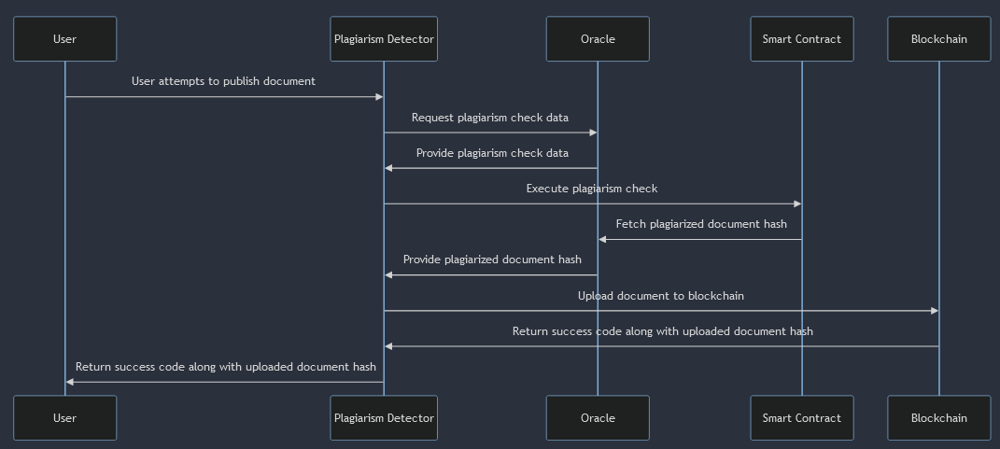

# SecureScholar AI

A system for uploading academic papers to a permissionless blockchain, ensuring decentralization. An AI plagiarism detector verifies originality, and papers are published using IPFS, promoting academic integrity, secure document sharing, and a decentralized approach to data storage.

## ML Pipeline

## Sequence Diagram
